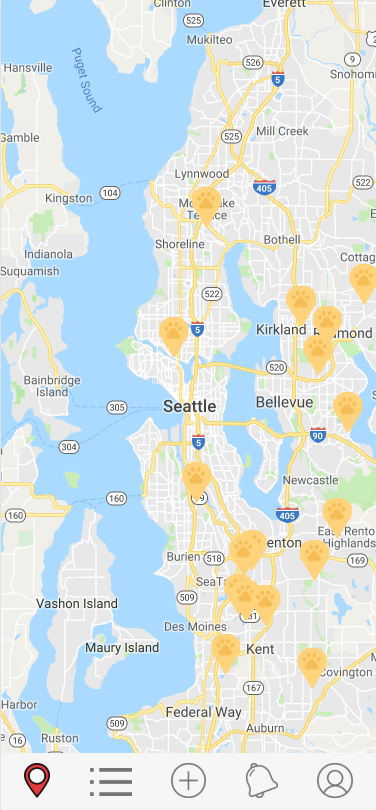
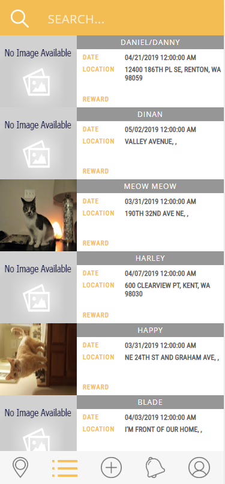
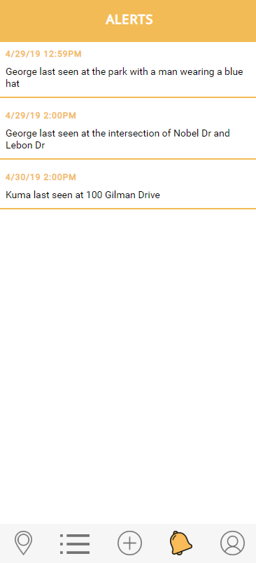
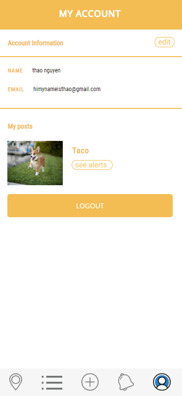
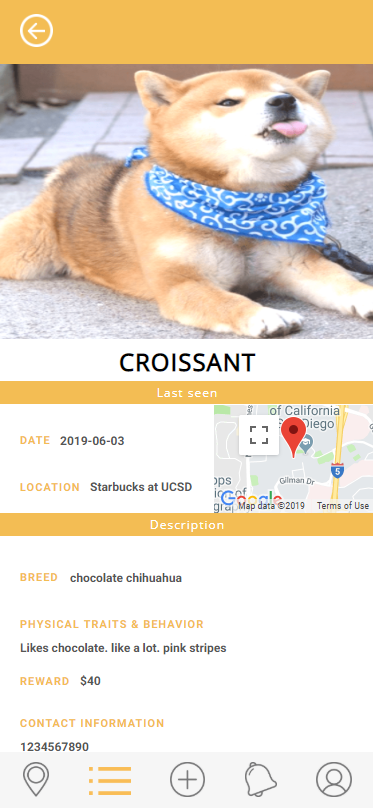
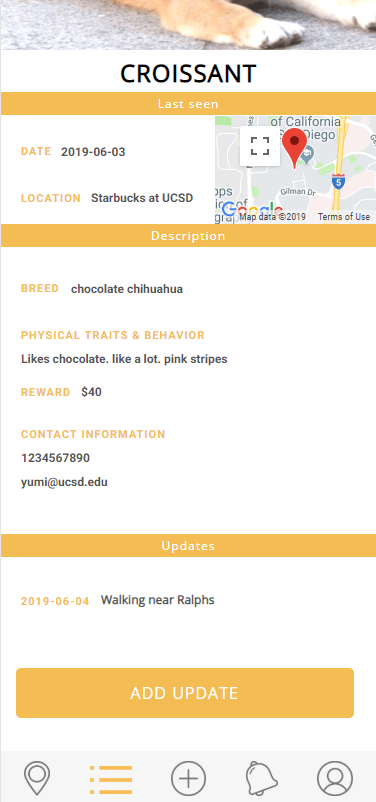

Team Name: Ferrets

Application Name: Trace

Names:
Thao Nguyen,
Varun Jit Singh,
Sasri Dedigama,
Yumi Minami

## UI Skeleton Webpages

#### Login Page

#### Forgot Password

#### Make Account

#### Map View

#### List View

#### Add

#### Alerts

#### Account

#### Edit Account

#### Pet Info

#### Add update

## Source Files
map.html
This file implements the map feature using the google maps api. The map is marked with various pins representing pets. The pins can be clicked on which redirects to the petMap.html page. 

list.html
This file shows all the pets in a list format. The user can search for a specific pet using the search bar or click on a pet's image which would lead them to pet.html page. 

petMap.html and pet.html 
These files can be accessed by clicking on the corresponding pet pin or picture from the map.html and list.html pages respectively. The information on these pages is more in depth on each pet and allows updates to be made regarding the pet's status. 

addLostPet.html
This page lets the user add a missing pet to the database. Users can enter in relevant information such as the pet's description, name and reward along with their own contact information. 
