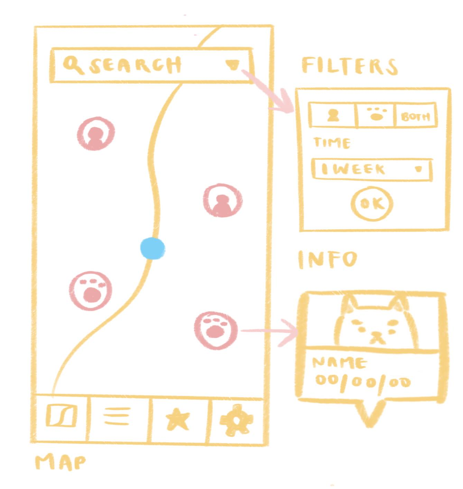
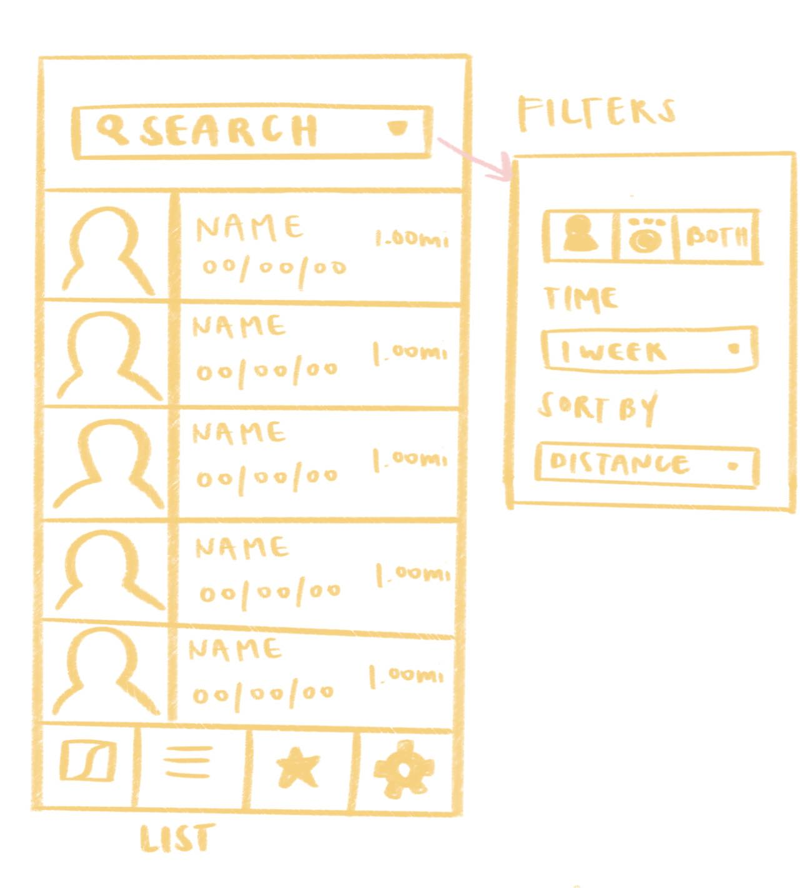
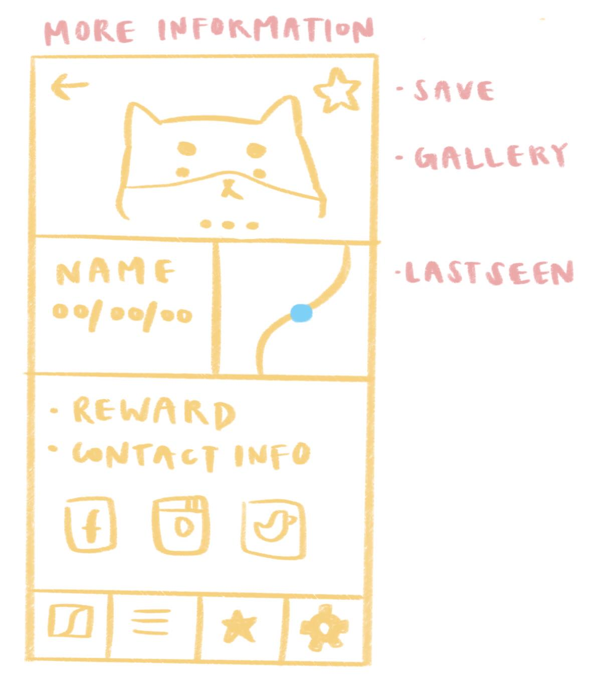
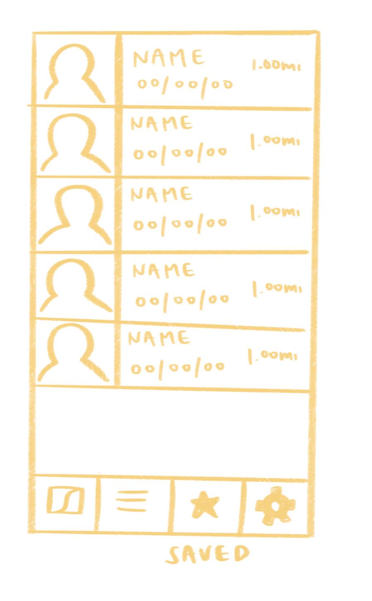
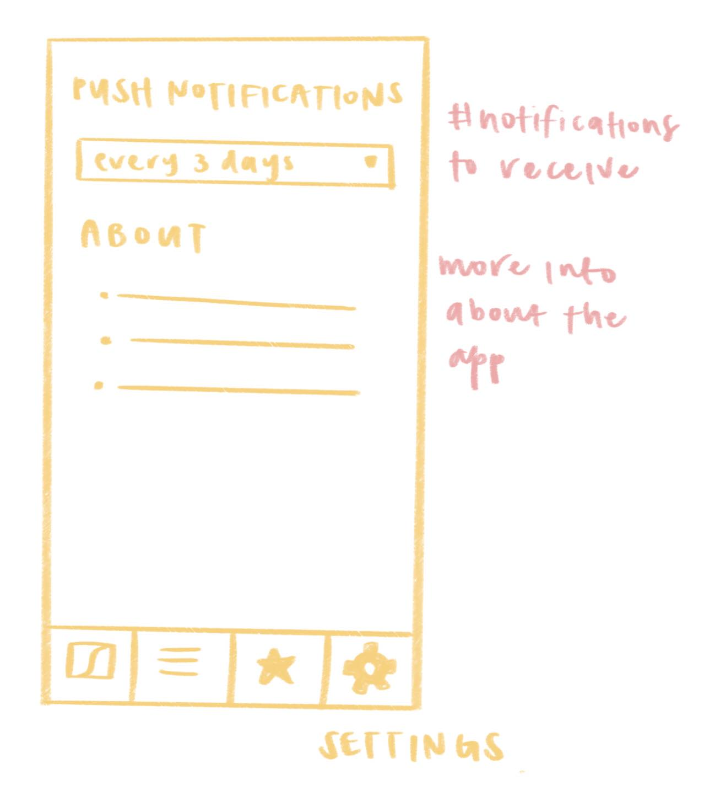
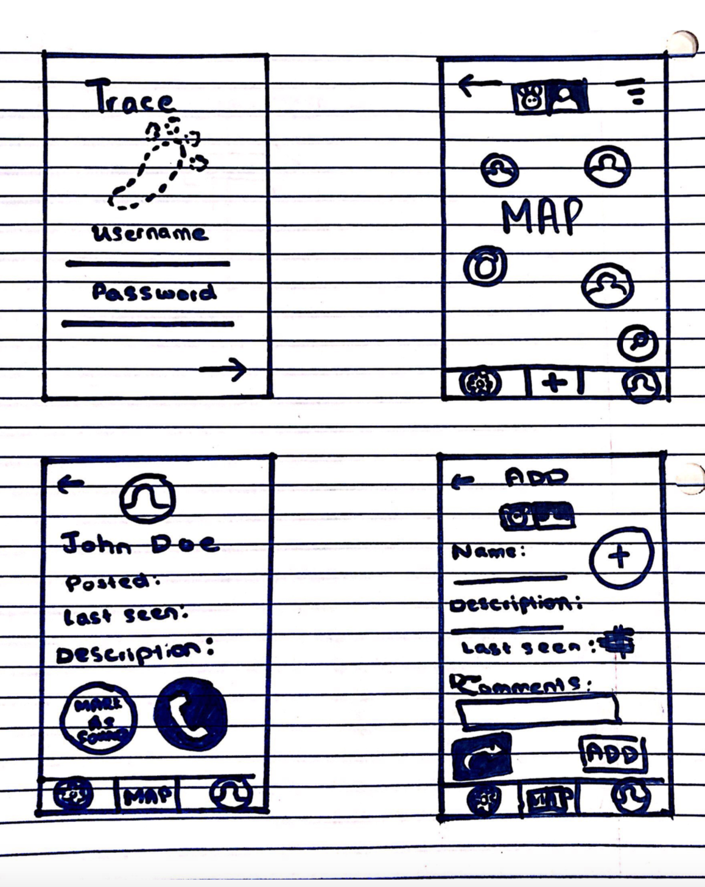
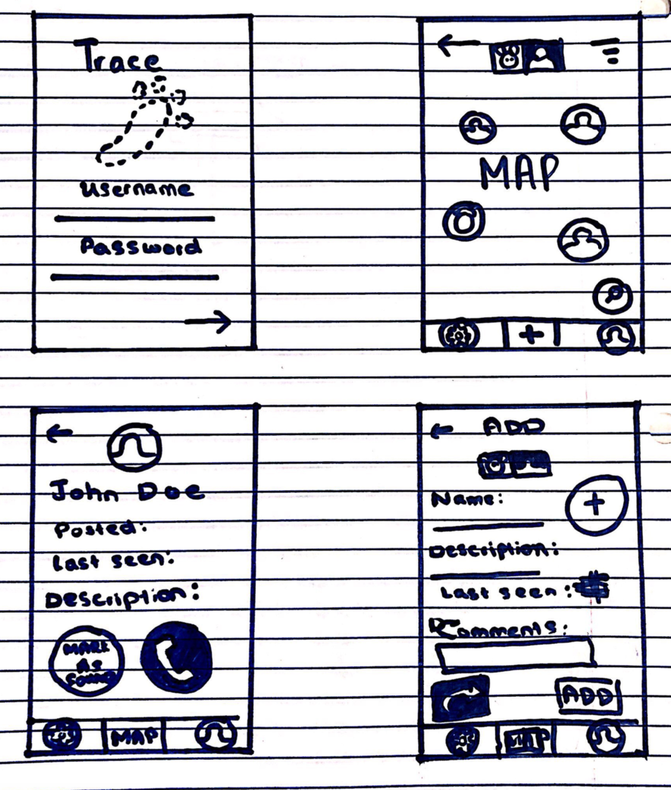
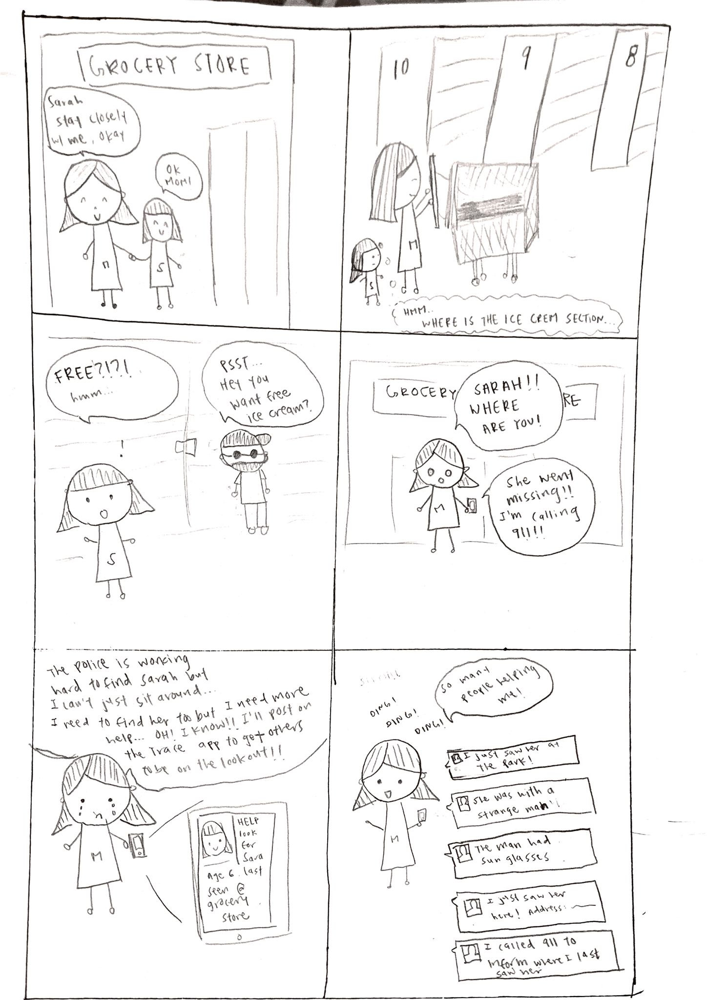
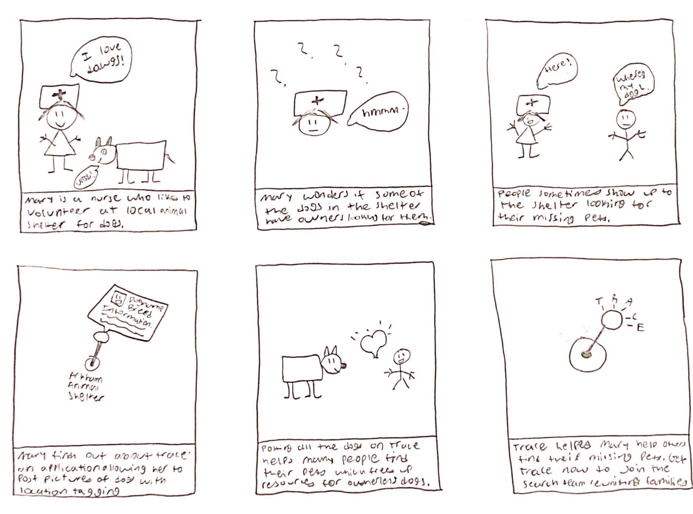

Team Name: Ferrets

Application Name: Trace

Names 
Thao Nguyen
Varun Jit Singh
Sasri Dedigama
Yumi Minami

**Project Proposal**
Target user population: People with missing loved ones or pets (aka “missing targets”). 
Project theme: This fits the project theme because none of us in our group have ever lost someone or something important to us to the point we needed to initiate a large scale search needing community support. We also want to provide a resource so that people have to go through fewer problems and less stress in their searches as these times can be emotionally challenging. Our application is meant to help our target user population in its search and enable efficient community support.
This application is intended to have two main user options
Searcher: The person looking for a missing target. 
Good Samaritan: A person wanting to lend their help in finding a missing target. 
APIs
Waze: The Waze GPS application has a feature that allows people to notify other drivers of where cops are located. We plan to take this feature and modify it so that people can pin drop areas they might have seen the missing target. 
NamUs: This is a repository of information of missing people across the United States. It has several critical features such as name, image, and last sighting that we can implement into our application.

**Paper Prototype #1** 
This paper prototype has five main screens: map, list, more information, saved, and settings. The map screen has your current location and all the missing people and pets. The list screen has all the nearby missing people and pets in a list format. Once you click on a people/pet it’ll take you to a screen where you can learn more information about the missing people/pet and share it to social media. You can use the search through the list as well as filter by people/pets, date, and distance. The saved screen is all the people/pets you have saved for quick access. The settings screen allows you to adjust when to receive push notifications alert as well as a brief description about the app.

**Paper Prototype #2**
This paper prototype has 8 screens. The home screen is a interactive map where you can filter between lost animals or lost humans (hence why some screens are duplicated). The add screen includes the ability to share where you can rapidly share a auto-generated lost post on social media.

**Storyboard 1**
Persona: Sarah’s Mom 
Profession: stay at home mom to take care of Sarah, her daughter 
Age: 35
Key personality traits: kind, loving 

**Storyboard 2**
Persona: Mary Doyle
Profession: A nurse for the Rady’s Children Hospital in San Diego who volunteers for local animal shelters on occasion. 
Age: 28
Key personality traits: Patient, good with children and animals, kind, studious, eager to contribute, sociable. 

