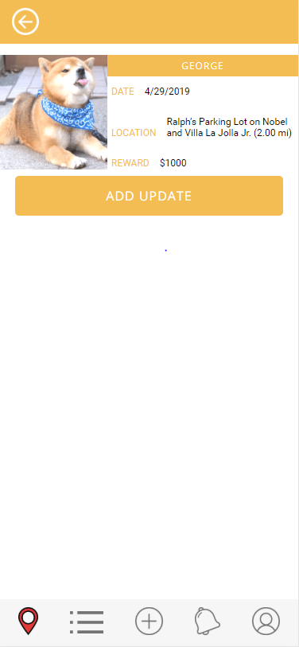
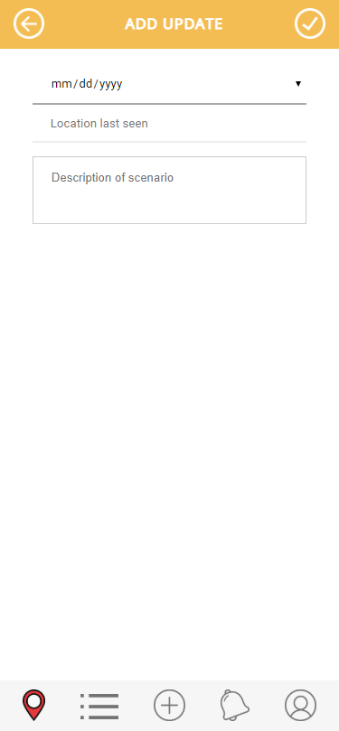

Team Name: Ferrets

Application Name: Trace

Names:
Thao Nguyen,
Varun Jit Singh,
Sasri Dedigama,
Yumi Minami
## How did our idea change

In our initial project idea we were planning to do both lost people and pets,
but after further discussion we decided to choose to focus just on pets.

## UI Skeleton Webpages

#### Login Page

#### Forgot Password

#### Make Account

#### Map View

#### List View

#### Add

#### Alerts

#### Account

#### Pet

#### Add Update

## Differences

For the most part we kept most of our initial ideas within the paper prototype.
Some of the key differences are:
Navigation Bar
We finalized the navigation bar to have map view, list view, add pets, alerts, and account information.

Login page
We added a sign up and forgot password option.

Map/List page
We removed the toggling between people and pets because we decided to focus on pets instead.
We decided to keep the map view and list view on separate pages.

Alerts
This page was added to allow the users to keep track of all the updates on the pets
they follow.

Account
We added more capabilities to the user including editing their personal information as
well as somewhere to keep track of their posts and the posts they're following.
