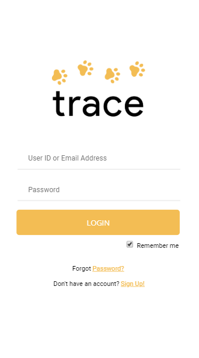
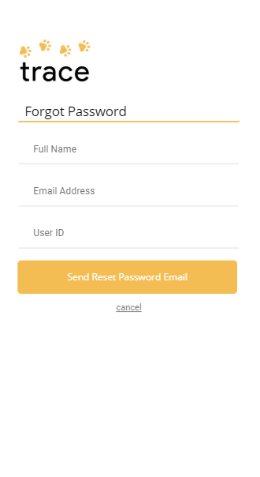
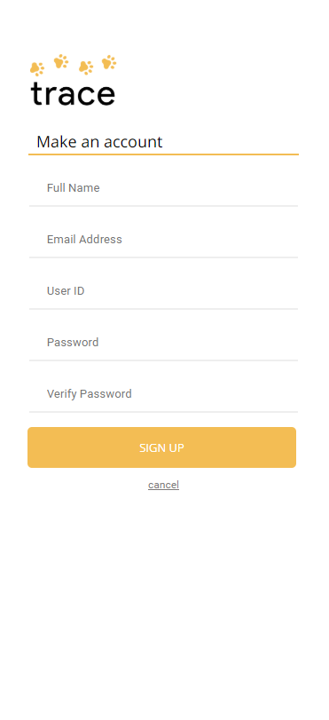
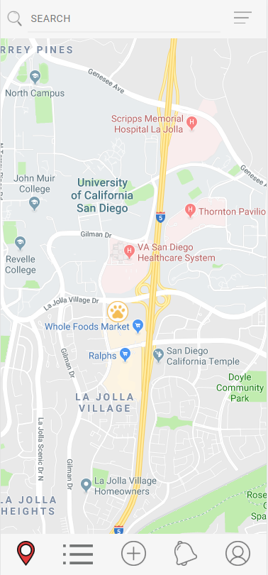
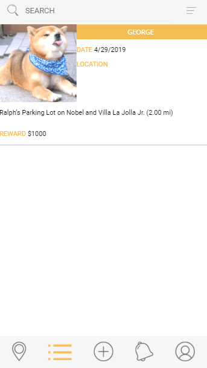
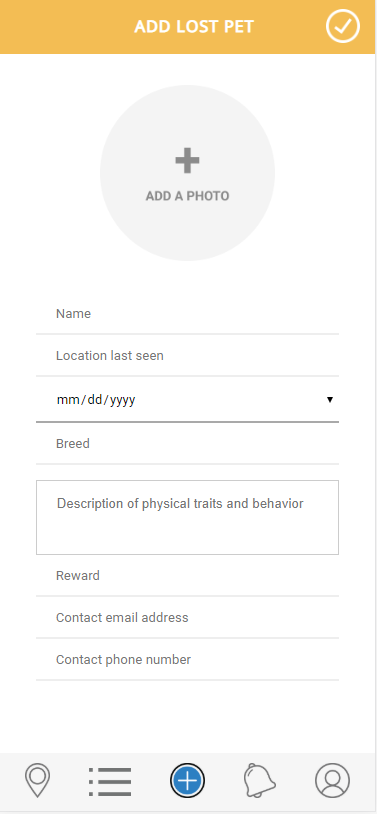
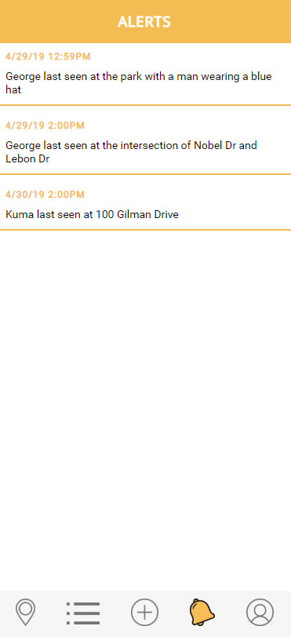
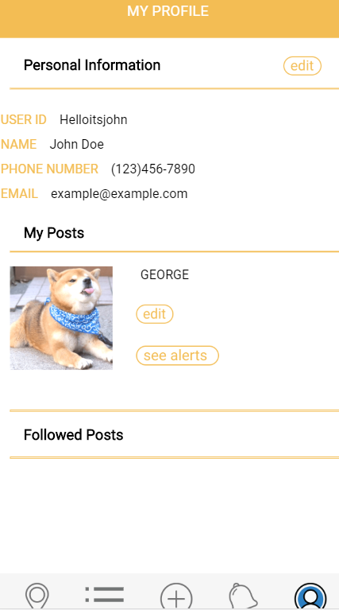

Team Name: Ferrets

Application Name: Trace

Names 
Thao Nguyen
Varun Jit Singh
Sasri Dedigama
Yumi Minami

## How did our idea change

In our initial idea we were going to do lost people and pets but after further discussion we decided to choose 
to do just lost pets. 

### UI Skeleton Webpages

#### Login Page

#### Forgot Password

#### Make Account

#### Map View

#### List View

#### Add 

#### Notifications

#### Profile

## Differences

For the most part the paper prototypes and uiskeleton are identical.
Some of the key differences are;
1) the footer nav bar has the map , list , add , notifications and profile
2) the login pages has a sign up and forgot password option
3) we added a notifications to notify the user about updates on posts they follow
4) we choose to have seperate tabs for list view and map view
5) theres no toggling between people and pets because we aren't doing pets anymore.

