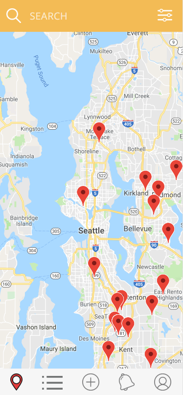
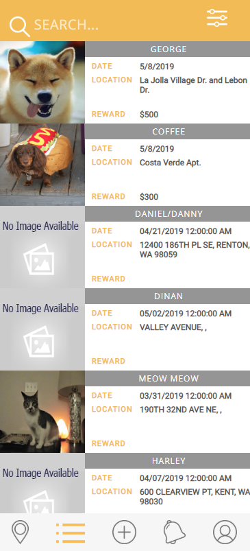
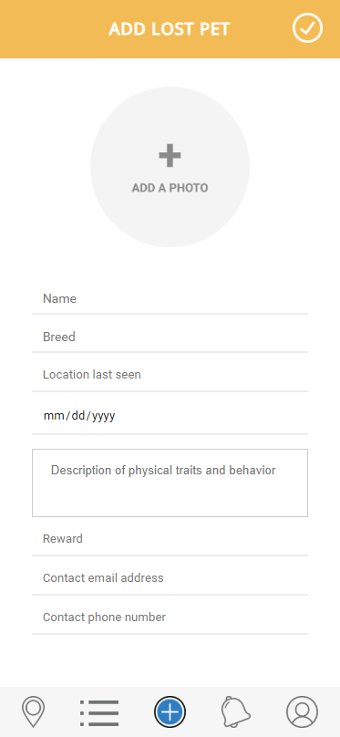
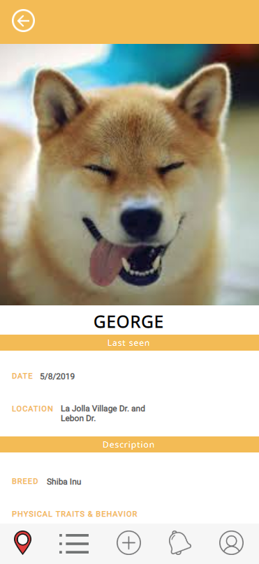

Team Name: Ferrets

Application Name: Trace

Names:
Thao Nguyen,
Varun Jit Singh,
Sasri Dedigama,
Yumi Minami

## UI Skeleton Webpages

#### Login Page

#### Forgot Password

#### Make Account

#### Map View

#### List View

#### Add

#### Alerts

#### Account

#### Edit Account

#### Pet Info

#### Add update

## UI Improvement
For the UI Improvement, we edited the html pages to adhere to the same theme color, fonts, and buttons. We simplified a lot of UI for the making an account page and profile page so the user could easily make an account and utilize our app while signed in. We also changed the UI for the pet description page so updates could be added. In addition, the search now filters out the list by the name of the pet.

## Interaction

For the first interaction, users can make an account on Trace. After making the account, the user can login and logout as well as easily edit their email and password.

For the second interaction, users can log in and search for pets by their name. Find the pet named "Allie". 
