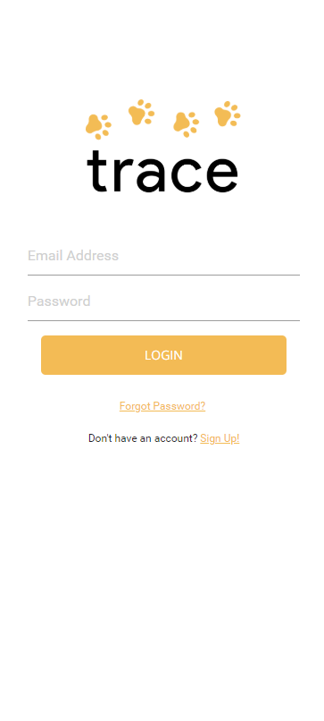
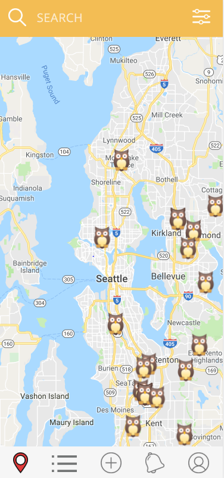
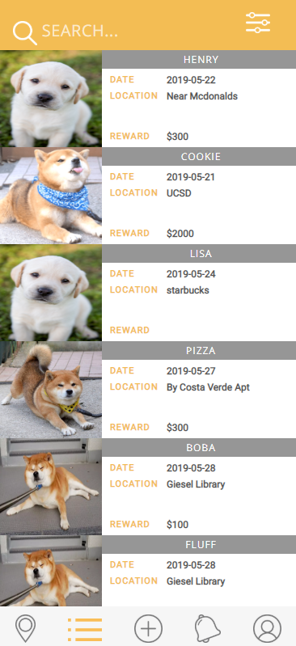
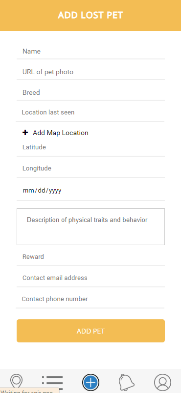
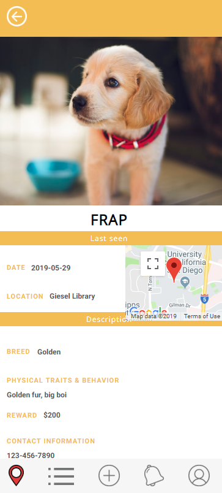
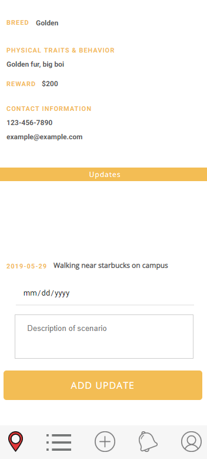
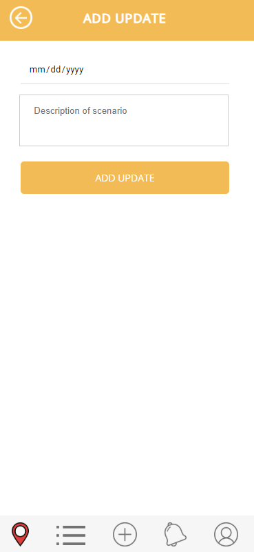

Team Name: Ferrets

Application Name: Trace

Names:
Thao Nguyen,
Varun Jit Singh,
Sasri Dedigama,
Yumi Minami

## UI Skeleton Webpages

#### Login Page

#### Forgot Password

#### Make Account

#### Map View

#### List View

#### Add

#### Alerts

#### Account

#### Edit Account

#### Pet Info

#### Add update

## How To Use
New users will start off on Trace by using the sign up button to create an account with their name, email and password. Upon clicking on sign up button they will be directed to the maps page. The tab bar on the bottom contains links to the main pages: Map, List, Add Pet, Notifications, and Profile. 

On the map page they can see the locations where the pets were seen. Hovering over the marker will give them a infow window preview with the pet's name and clicking on the marker can direct them to the page corresponding to that pet. 

They can see a list of the missing pets on the list view. The list page contains a more in depth preview of the pet's information then the maps page info windows do by showing the pet picture, date, location, and reward. 

The add pets page lets users add a pet to the database. They will be able to enter in the pet's name, photo, breed, last seen location, date, description, reward, and contact information. 

The notication page simply shows alerts and the profile page shows the user's information. 

## UI Improvements
...

## Data Visualization
...

## Potential Improvements
...

## Data Pictures
...

## How we implemented
We implemented front end UI/UX features using HTML, CSS, and JavaScript. The back end was implemented using Firebase's Firestore database. Firestore was implemented to store all of the data of the users and pets. We also used the Google Maps API to display the map with the markers on the maps page. The API was also used in the add pets page to set the pet's location. 

